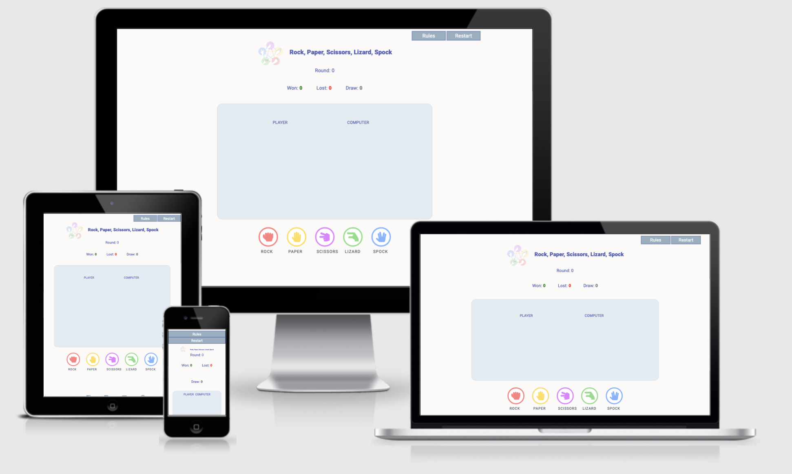
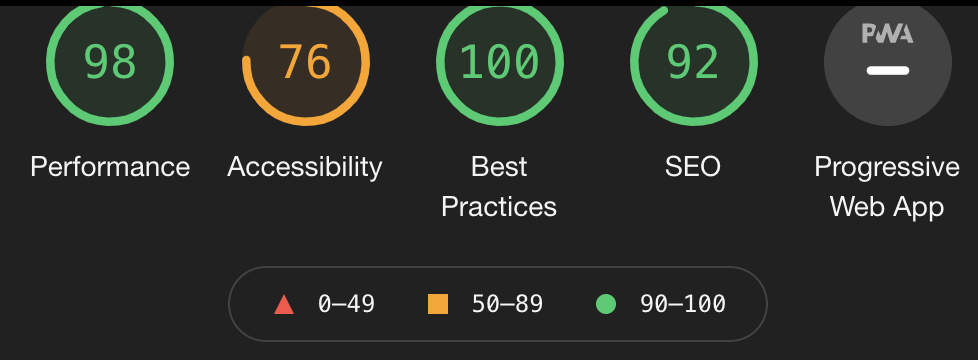

# Morgan Monnet's RPSLS

[View the live project here](https://mpysys.github.io/rock-paper-scissors-lizard-spock/)

## Table of contents
1. [Introduction](#Introduction)
2. [UX](#UX)
    1. [Ideal User Demographic](#Ideal-User-Demographic)
    2. [User Stories](#User-Stories)
    3. [Development Planes](#Development-Planes)
    4. [Design](#Design)
3. [Features](#Features)
    1. [Design Features](#Design-Features) 
    2. [Existing Features](#Existing-Features)
    3. [Features to Implement in the future](#Features-to-Implement-in-the-future)
4. [Issues and Bugs](#Issues-and-Bugs)
5. [Technologies Used](#Technologies-Used)
     1. [Main Languages Used](#Main-Languages-Used)
     2. [Frameworks, Libraries & Programs Used](#Frameworks,-Libraries-&-Programs-Used)
6. [Testing](#Testing)
7. [Deployment](#Deployment)
     1. [Deploying on GitHub Pages](#Deploying-on-GitHub-Pages)
8. [Credits](#Credits)
     1. [Content](#Content)
     2. [Media](#Media)
     3. [Code](#Code)
9. [Acknowledgements](#Acknowledgements)
***

## Introduction

**Rock, Paper, Scissors, Lizard,  [Spock](https://bigbangtheory.fandom.com/wiki/Spock "Spock")** is a game of chance that expands. It is first used to settle a dispute about what to watch on TV between  [Sheldon](https://bigbangtheory.fandom.com/wiki/Sheldon_Cooper "Sheldon Cooper")  and  [Raj](https://bigbangtheory.fandom.com/wiki/Rajesh_Koothrappali "Rajesh Koothrappali")  in "[The Lizard-Spock Expansion](https://bigbangtheory.fandom.com/wiki/The_Lizard-Spock_Expansion "The Lizard-Spock Expansion")".

It is mentioned again in "[The Rothman Disintegration](https://bigbangtheory.fandom.com/wiki/The_Rothman_Disintegration "The Rothman Disintegration")", where Sheldon explains the rules to  [Penny](https://bigbangtheory.fandom.com/wiki/Penny "Penny")  and  [Barry Kripke](https://bigbangtheory.fandom.com/wiki/Barry_Kripke "Barry Kripke").

The game was originally created by  [Sam Kass](https://bigbangtheory.fandom.com/wiki/Sam_Kass "Sam Kass")  with Karen Bryla. According to an interview with Kass, the series producers did not originally ask for permission to use the game, but Kass was officially referenced by Sheldon as the creator of the game during the "[The Rothman Disintegration](https://bigbangtheory.fandom.com/wiki/The_Rothman_Disintegration "The Rothman Disintegration")", after which he states, "Hail Sam Kass!" to which  [Leonard](https://bigbangtheory.fandom.com/wiki/Leonard_Hofstadter "Leonard Hofstadter"),  [Howard](https://bigbangtheory.fandom.com/wiki/Howard_Wolowitz "Howard Wolowitz"), Raj, and Sheldon all then chant "Hail!" while raising their hands.

This is the second of four Milestone Projects that the developer must complete during their Full Stack Web Development Program at The Code Institute. 

The main requirements for this project were to make a responsive and static website with a minimum of three pages using primarily **HTML5**, **CSS3** and **Javascript**.

[Back to top ⇧](#Morgan-Monnet's-RPSLS)

## UX 

### Ideal User Demographic
#### The ideal user of this website is:
- External users 
- Site owner

### User Stories
#### External user:
 -   The site’s users want to play an online game that has elements of chance.

#### Site Owner:
 -   The site’s goal is to provide a challenging game to entertain online users.

### Development Planes

#### Strategy
Broken into three categories, the website will focus on the following functions:
- **Game Area**

- **Controllers**

- **Score Area**
 

The website needs to enable the **user** to:
- Play the game:
     - Select a gesture
     - Restart the game
     - Tally points
     - Read Rules

The website needs to enable  **the computer** to:
- Respond when the user selects a gesture
- To check if the computer answer wins vs. the player
- Tally up the points

#### Scope
To clearly identify what needed to be done according to the strategy above, I defined what content and functionality needed to be on the website:
- **Content Requirements**
     - Game area defined where the output of the user and computer answer will be displayed
     - Controller area to enable user to select gesture
     - Area to keep score
     - Restart button to reset points
     - Rules button with explicit definition of game
    
- **Functionality Requirements**
     - Trigger to game start
     - Trigger for computer to start "thinking" of their answer
     - Verification of winState 
     - Incrementing scores
     - Restart functionality

#### Structure
I opted in for a simple one page design split out into **three sections**:
1. Game Area
2. Controllers
3. Score area 

#### Wireframe
Wireframe mockups were created in [Balsamiq](https://balsamiq.com/) with the aim to be straightforward and modern in design:

- [Landing page](./assets/readme-files/balsamiq.png)

### Design

#### Colour Scheme
The main colours used throughout the website are a mixture of White and Blue as well as variety of colors for the buttons.

I chose these colors as they are bright and warm. Visually pleasing and simple

#### Typography
The pairing of the fonts [Roboto](https://fonts.google.com/specimen/Roboto "Link to Roboto Google Font") is used throughout the website with Sans Serif as the fallback font in case of import failure. 

#### Imagery
The hands used were found on another developers [website](https://veerasundar.com/rock-paper-scissor-lizard-spoc/)

[Back to top ⇧](#Morgan-Monnet's-RPSLS)

## Features

### Game Features
- **Computer Answer** has a recursion in order to show that the computer is "thinking"
- **Restart** gives the user the ability to reset scores
- **imagery for user/computer response** & **classList** Add and remove "hidden" class to imagery to make the output more pleasing 

### Features to Implement in the future
- **High Score**
     - **Feature** - potentially adding a local storage high score section
     - **Reason for not featuring in this release** - Didn't see the use case here being something interesting for the player after doing some testing with friends and family

[Back to top ⇧](#Morgan-Monnet's-RPSLS)

## Issues and Bugs 
I ran into various issues during the development of the website. Please find below the noteworthy ones as well as the solutions/ideas that I came up with:

**spinAnswer** - Challenging to find out the best way to showcase the computer thinking - it came down to using a recursion where the spinAnswer function calls itself until enough time has passed.

**classList.remove/add** - Challenged by the add/remove of classes in order to ensure user experience was flawless throughout gameplay. It took me a few times to get a good grasp of the .forEach to ensure images (hands) were displayed & removed at the right time.

[Back to top ⇧](#Morgan-Monnet's-Personal-Portfolio)

## Technologies Used
### Main Languages Used
- [HTML5](https://en.wikipedia.org/wiki/HTML5 "Link to HTML Wiki")
- [CSS3](https://en.wikipedia.org/wiki/Cascading_Style_Sheets "Link to CSS Wiki")
- [Javascript](https://en.wikipedia.org/wiki/Javascript "Link to JS Wiki")

### Frameworks, Libraries & Programs Used
- [Bootstrap](https://getbootstrap.com/docs/4.4/getting-started/introduction/ "Link to Bootstrap page")
     - Bootstrap was used to implement the responsiveness of the site, using bootstrap classes.
- [Google Fonts](https://fonts.google.com/ "Link to Google Fonts")
    - Google fonts was used to import the fonts "Roboto", "Lato" and "Montserrat" into the style.css file. These fonts were used throughout the project.
- [Font Awesome](https://fontawesome.com/ "Link to FontAwesome")
     - Font Awesome was used on all pages throughout the website to import icons (e.g. social media icons) for UX purposes.
- [Git](https://git-scm.com/ "Link to Git homepage")
     - Git was used for version control by utilizing the GitPod terminal to commit to Git and push to GitHub.
- [GitHub](https://github.com/ "Link to GitHub")
     - GitHub was used to store the project after pushing
- [balsamiq](https://www.balsamiq.com/ "Link to Balsamiq homepage")
     - Figma was used to create the wireframes during the design phase of the project.
- [Am I Responsive?](http://ami.responsivedesign.is/# "Link to Am I Responsive Homepage")
     - Am I Responsive was used in order to see responsive design throughout the process and to generate mockup imagery to be used.

[Back to top ⇧](#Morgan-Monnet's-RPSLS)

## Testing

Industry standard Validator results:
- [W3C HTML Validator - Results](https://validator.w3.org/nu/?doc=https%3A%2F%2Fmpysys.github.io%2Frock-paper-scissors-lizard-spock%2F "Link to W3C HTML Validator") -
- [W3C CSS Validator - Results](https://jigsaw.w3.org/css-validator/validator?uri=https%3A%2F%2Fmpysys.github.io%2Frock-paper-scissors-lizard-spock%2F&profile=css3svg&usermedium=all&warning=1&vextwarning=&lang=en "Link to W3C CSS Validator")

I have also run Lighthouse test, see below results:

### BUGS
Only bug at this time is related to media queries and will be addressed shortly.
Otherwise the bugs I ran into were related to DOM .add/.remove "hidden" classes, but they have been solved.

## Deployment
This project was developed using [Gitpod](https://gitpod.io/ "Link to GitPod site"), committed to git and pushed to GitHub using their browser terminal.

### Deploying on GitHub Pages
To deploy this page to GitHub Pages from its GitHub repository, the following steps were taken:

1. Log into [GitHub](https://github.com/login "Link to GitHub login page") or [create an account](https://github.com/join "Link to GitHub create account page").
2. Locate the [GitHub Repository](https://github.com/mpysys/portfolio-personal "Link to GitHub Repo").
3. At the top of the repository, select Settings from the menu items.
4. Scroll down the Settings page to the "GitHub Pages" section.
5. Under "Source" click the drop-down menu labelled "None" and select "Master Branch".
6. Upon selection, the page will automatically refresh meaning that the website is now deployed.
7. Scroll back down to the "GitHub Pages" section to retrieve the deployed link.
8. At the time of submitting this Milestone project the Development Branch and Master Branch are identical.

[Back to top ⇧](#Morgan-Monnet's-Personal-Portfolio)

## Credits 

### Content
- The structure of the README was inspired by [Kryan Live](https://github.com/rebeccatraceyt/KryanLive/blob/master/README.md)
- The inspiration to make the skills bar comes from [Veera Sundar](https://veerasundar.com/)

### Code 
I consulted multiple sites in order to better understand the code I was  trying to implement. The following sites were used on a more regular basis:
- [Stack Overflow](https://stackoverflow.com/ "Link to Stack Overflow page")
- [W3Schools](https://www.w3schools.com/ "Link to W3Schools page")
- [Bootstrap](https://getbootstrap.com/ "Link to BootStrap page")
- [StackEdit](https://stackedit.io "Link to Stackedit page")

[Back to top ⇧](#Morgan-Monnet's-RPSLS)

## Acknowledgements

- I would like to thank my mentors Antonio for their valuable feedback and critic during the process of design and development.
- I would like to thank Code Institute for giving me a little extra time to finish this module!
- I would like to thank my friends from Brewchachos who have tested and shared great feedback throughout the process.

[Back to top ⇧](#Morgan-Monnet's-RPSLS)